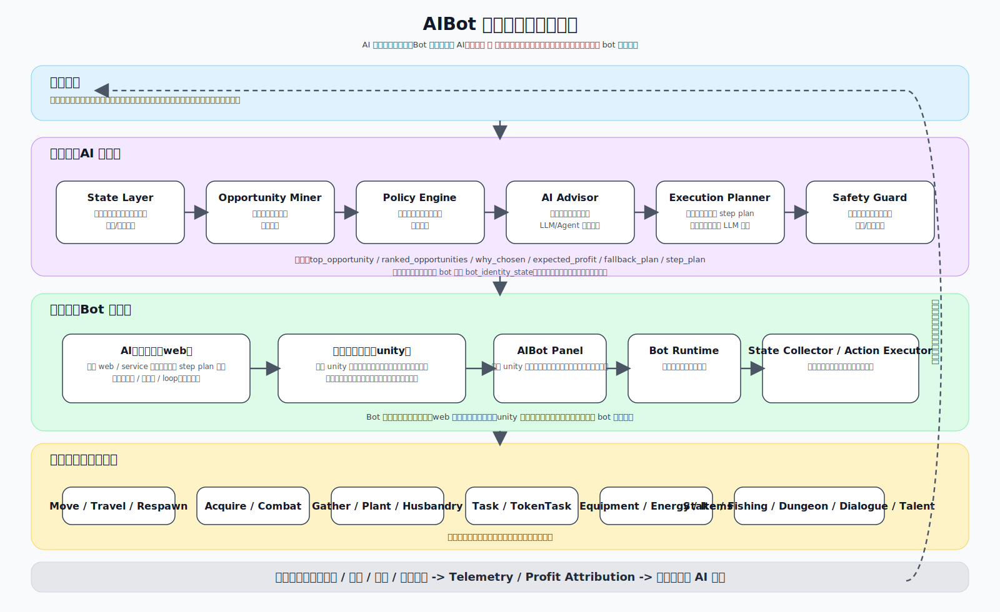
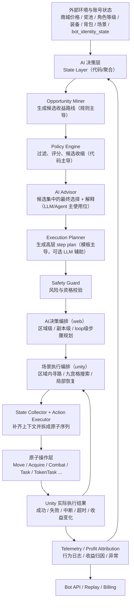

# AIBot 三层结构与运行流程说明

## 1. 目的

本文用于把当前 `AIBot` 的正式结构整理成一套更容易理解的“三层模型”：

1. `AI 决策层`
2. `Bot 编排层`
3. `原子操作层`

并通过具体角色案例，说明它们如何共同完成“面向赚钱目标的自动化运行”。

## 2. 权威来源与适用范围

本文不单独创造新架构，统一以以下文档为准：

- [lumiterra-aibot-product-plan.md](/Users/44alex/work/meland/odyssey-v2/lumiGameBot/docs/lumiterra-aibot-product-plan.md)
- [006_AI大脑服务与决策分层落地.md](/Users/44alex/work/meland/odyssey-v2/lumiGameBot/plans/006_AI大脑服务与决策分层落地.md)
- [007_2026-03-25_讨论同步与移交说明.md](/Users/44alex/work/meland/odyssey-v2/lumiGameBot/plans/007_2026-03-25_讨论同步与移交说明.md)
- [008_游戏内操作原子详细清单.md](/Users/44alex/work/meland/odyssey-v2/lumiGameBot/plans/008_游戏内操作原子详细清单.md)

适用范围：

- 只讨论 `角色已经登录并进入游戏场景后` 的 `AIBot` 运行
- 不讨论登录、创角、钱包连接、社交、设置等非当前版本主线

## 3. 三层概论

### 3.1 总体定义

当前 `AIBot` 最适合被理解为三层协作系统：

| 层级 | 主要职责 | 核心问题 |
|---|---|---|
| `AI 决策层` | 判断当前应该跑哪条收益线，以及为什么 | `现在做什么最赚钱` |
| `Bot 编排层` | 把高层决策拆成可执行步骤，并在 web 与 unity 两端完成编排 | `这个决策该怎么稳定执行` |
| `原子操作层` | 在 Unity 中执行最小动作单元 | `这一步具体怎么做` |

### 3.2 一句话理解

- `AI 决策层` 决定方向
- `Bot 编排层` 决定步骤
- `原子操作层` 决定动作

也就是：

`AI 决定目标 -> Bot 决定流程 -> Atoms 真正执行`

### 3.3 三层为什么必要

如果只有 `AI` 没有 `Bot`：

- 决策可以产生，但很难稳定落地
- 很多运行时异常没地方处理

如果只有 `Bot` 没有 `AI`：

- 只能跑固定脚本
- 无法根据市场、奖池、账号状态做动态路线选择

如果没有 `原子层`：

- 编排无法映射到 Unity 的真实执行入口
- 动作粒度会过粗，难以复用、观测和调试

### 3.5 独立 Bot 原则

当前正式设计不采用：

- 中央统一派工
- 多角色统一分工
- 一个全局调度器给每个 bot 指定固定职业

当前正式设计采用：

- 每个 bot 都是独立个体
- 每个 bot 独立做本地路线选择
- bot 之间允许竞争
- 但每个 bot 的决策函数需要带有 `个体差异`

这里的“个体差异”主要来自：

- `bot_identity_state`
- `persona_profile`
- `risk_profile`
- `loop_preference_weights`
- `recent_action_memory`
- `anti_repeat_cooldowns`
- `stable_noise_seed`

因此，目标不是让多个 bot 被中央统一分工，而是让它们在相同外部环境下，仍然因为个体差异而做出不完全相同的选择。

### 3.4 三层与子项层级关系总览

在进入详细说明前，先把三层和子项的归属关系看成下面这张结构树：

#### `AI 决策层`

- `State Layer`
  - 汇总可用于决策的状态输入
- `Opportunity Miner`
  - 从状态里生成候选赚钱路线
- `Policy Engine`
  - 负责过滤、评分、收缩候选集
- `AI Advisor`
  - 在可行候选集中做最终选择，并输出解释
- `Execution Planner`
  - 把高层机会转换成结构化执行计划
- `Safety Guard`
  - 对高风险、越权或异常路线做最后保护

#### `Bot 编排层`

- `AI决策编排`
  - 位于 `web / service` 侧，负责高层 `step plan` 组织，以及区域级 / 副本级 / loop 级目标规划
- `场景执行编排`
  - 位于 `unity` 侧，负责九宫格视野下的场景内执行落地，以及局部搜索、局部移动与本地恢复
- `AIBot Panel`
  - 位于 `unity` 侧，负责展示 bot 状态、决策结果、行为日志与人工接管入口
- `Bot Runtime`
  - 驱动 bot 主循环和运行时状态
- `State Collector`
  - 从 Unity 采集本地执行状态
- `Action Executor`
  - 把计划拆成原子序列并执行
- `Safety Guard`
  - 在执行期处理本地异常、冲突和越权
- `Manual Override`
  - 玩家接管、暂停、恢复
- `Telemetry`
  - 记录行为、收益和异常
- `Bot API`
  - 提供 bot 配置、心跳、决策请求、telemetry 接入
- `Billing and Entitlement`
  - 判断 bot 是否有资格运行以及开放哪些能力
- `Backtest and Replay`
  - 存储决策与行为日志，支持复盘和收益归因

#### `原子操作层`

- `MoveAtoms`
  - 移动与寻路
- `TravelAtoms`
  - 场景切换
- `RespawnAtoms`
  - 复活处理
- `TargetAcquireAtoms`
  - 搜索和锁定目标
- `CombatAtoms`
  - 战斗执行
- `ResourceGatherAtoms`
  - 采集与通用场景交互
- `EnergyAtoms`
  - 精力补给
- `ConsumableAtoms`
  - 消耗品使用
- `EquipmentAtoms`
  - 装备穿脱
- `DialogueAtoms`
  - 对话交互
- `TalentAtoms`
  - 天赋成长
- `PlantingAtoms`
  - 场景种植
- `HusbandryAtoms`
  - 场景畜牧
- `TaskAtoms`
  - 普通任务
- `TokenTaskAtoms`
  - Token 任务
- `EquipmentStakeAtoms`
  - 装备质押与熔炼
- `FishingAtoms`
  - 钓鱼
- `DungeonAtoms`
  - 副本

## 4. 第一层：AI 决策层

## 4.1 定义

`AI 决策层` 负责回答：

- 当前账号此刻最适合做什么
- 为什么做它
- 这条路线预期收益和风险如何
- 如果失败，下一条降级路线是什么

它不直接发网络包，不直接控制输入，不直接做链上交易。

当前正式口径不是“把整层都交给 agent / LLM”，而是：

- `结构化代码与规则` 主导决策骨架
- `LLM / Agent` 只参与指定子项
- 每个 bot 保持独立决策，不采用中央统一分工

## 4.1.1 agent / LLM 在 AI 决策层中的使用位置

建议口径如下：

| 子项 | 主要实现方式 | 是否使用 `LLM / Agent` |
|---|---|---|
| `State Layer` | 代码 / 数据聚合 | 否 |
| `Opportunity Miner` | 代码 / 规则生成候选机会 | 默认否，可保留弱辅助 |
| `Policy Engine` | 代码 / 规则 / 评分模型 | 否，必须由结构化逻辑主导，负责候选过滤与收缩 |
| `AI Advisor` | 候选集中的最终选择层 | 是，这里是 `LLM / Agent` 的主使用位 |
| `Execution Planner` | 模板 + 规则为主 | 可选地让 `LLM` 辅助生成 step plan |
| `Safety Guard` | 代码 / 规则 / 白名单阈值 | 否 |

也就是说：

- `LLM / Agent` 的强参与位在 `AI Advisor`
- `LLM / Agent` 的弱参与位可在 `Execution Planner`
- `Policy Engine` 不负责最终拍板，而负责把问题收缩到安全、可行、收益合理的候选集合
- 最终 `top_opportunity` 更适合由 `AI Advisor / Agent` 在候选集中完成决断

## 4.2 子项结构

按当前正式文档，`AI 决策层` 应拆成 6 个子项：

### 1. `State Layer`

作用：

- 汇总可用于决策的状态输入

主要输入：

- Unity 客户端可观测状态
- 任务、背包、装备、精力、场景状态
- 链上公开数据
- 商城、奖池、公共配置、授权状态
- 静态表数值
- bot 个体状态：`bot_identity_state`、偏好、风险参数、最近行为记忆

回答的问题：

- `当前账号是什么状态`
- `外部环境现在是什么状态`

### 2. `Opportunity Miner`

作用：

- 从状态里生成候选赚钱路线

输出的是候选项，不是最终结论。

例如：

- `token_task_loop`
- `direct_l3_combat_farm`
- `level_up_then_l3_farm`
- `skip_current_market_loop`

回答的问题：

- `现在有哪些可能的赚钱机会`

### 3. `Policy Engine`

作用：

- 对候选机会做过滤、评分、排序与候选收缩

它不是最终拍板者，而是“安全、可行、收益合理候选集”的收缩层。

主要考虑：

- 预期收益
- 单位时间收益
- 死亡风险
- 药耗、气力、预算
- 装备与等级是否匹配
- 背包压力
- 外部机会的流动性
- bot 个体偏好与反重复记忆
- 稳定扰动下的个体差异化排序

回答的问题：

- `哪些候选是当前可以进入最终决断阶段的`
- `哪些候选应该直接淘汰`

补充说明：

- `Policy Engine` 不应越级做完全部最终决断
- 它应先完成：`硬约束过滤 + 基础收益评分 + 候选收缩`
- 这样后续 `AI Advisor / Agent` 才能在较小、较安全的候选集合中做更强的最终选择

### 4. `AI Advisor`

作用：

- 在 `Policy Engine` 给出的可行候选集中做最终重排和最终选择
- 解释为什么选这个
- 输出可读的理由和 fallback 建议

这里是当前最适合使用 `LLM / Agent` 的位置。

典型输出：

- `why_chosen`
- `why_not_others`
- `fallback_plan`

回答的问题：

- `在当前可行候选集中，这个 bot 最终应该选哪条`
- `为什么这样选`

### 5. `Execution Planner`

作用：

- 把高层机会转换成结构化执行计划

注意：

- 它不该直接输出“底层按键”
- 它应输出“阶段性 step plan / 子目标计划”
- 它更适合 `模板化 / 规则化主导`
- 如需引入 `LLM`，应只让它辅助生成可读、可审查的 step plan，而不是直接控制底层动作

例如：

- `先接任务 -> 再去怪区 -> 再提交 -> 再领奖`

回答的问题：

- `这条收益线大概要怎么跑`

### 6. `Safety Guard`

作用：

- 做必要的最后保护，而不是默认拦截所有动作

主要处理：

- entitlement
- 高成本动作
- 不可逆动作
- 连续异常失败
- 人工接管
- 超预算

回答的问题：

- `这条路线虽然看起来对，但当前允许执行吗`

## 4.3 AI 决策层的作用边界

它应该决定：

- 收益线
- 路线优先级
- 阶段性子目标
- 个体 bot 在相同外部环境下的差异化路线倾向

它不应该决定：

- 每一帧怎么走
- 每次坐标同步
- 每个网络包何时发
- 每一次局部失败后的微恢复细节
- 也不应该采用“中央统一分工”的方式给所有 bot 派工

## 5. 第二层：Bot 编排层

## 5.1 定义

`Bot 编排层` 是 AI 和 Unity 原子之间的中间编排层。

它负责把：

- AI 的高层决策

变成：

- 可执行的步骤
- 可恢复的运行时流程
- 可记录的行为链路

当前正式口径下，`Bot 编排层` 不是单点模块，而是两个子层协作：

- `AI决策编排`
- `场景执行编排`

## 5.2 为什么这层不能省

它解决的是典型的“中间复杂度”问题：

- AI 的输出太高层，不能直接执行
- 原子层太底层，不能自己决定整条赚钱路线

所以必须有一层去负责：

- 步骤拆解
- 执行顺序
- 超时重试
- 异常恢复
- 接管与暂停

如果只放 web：

- 无法处理九宫格视野下的局部目标发现
- 无法处理场景内局部寻路、巡逻和本地状态机

如果只放 unity：

- 外部公共数据、日志、收益归因、商城和奖池环境处理会过重
- 高层 step plan 不利于回放、复盘和统一升级

## 5.3 Bot 编排层的子项

当前更合理的理解是：`Bot 编排层` 同时存在于 web 和 unity，两边各自承担不同子层职责。

当前正式口径下，`Bot 编排层` 也不是一个“多角色中央调度器”。

它负责的是：

- 单个 bot 的运行时编排
- 单个 bot 如何把自己的决策落成步骤
- 单个 bot 如何处理失败、接管和恢复

它不负责：

- 跨 bot 统一派工
- 多 bot 统一分工
- 多 bot 的中央竞争裁决

### A. `AI决策编排`（web / service 侧）

作用：

- 把 `AI 决策层` 输出的高层收益路线，继续整理成可执行的高层 step plan
- 负责“远目标 / 区域目标 / 玩法目标”的组织
- 不下沉到场景内的具体实体搜索和局部移动

它更适合处理的事情：

- 目标路线属于哪类赚钱 loop
- 目标区域或目标副本的选择
- 目标击杀数量、目标任务数量、目标收益阈值
- fallback 条件
- 与商城、奖池、配置、日志相关的高层步骤规划

例如：

- `去 6级怪 XXX 的候选区域 A`
- `在区域 A 内完成击杀 n 只`
- `如果该区域长时间无收益，则切区域 B`
- `如果 Token 奖池回报下降，则切换收益线`

### B. `场景执行编排`（unity 侧）

作用：

- 把高层 step plan 变成当前场景内真正可执行的局部动作链
- 负责在九宫格视野限制下完成目标搜索、接近、战斗、采集与恢复

它更适合处理的事情：

- scene 配置数据读取
- 区域坐标解析
- 进入目标区域
- 九宫格视野内的怪物或资源搜索
- 区域内巡逻、换点、重试
- 本地状态机、死亡、中断、目标失效处理

例如：

- 先移动到 6 级怪的刷新区域
- 到区域后开始局部巡逻
- 在当前视野内发现目标怪后开始战斗原子链
- 如果该九宫格内没有目标，则在区域内换点继续搜索

### C. Unity 运行时子项

#### 1. `AIBot Panel`

作用：

- 位于 `unity` 侧
- 展示 bot 状态
- 展示 AI 决策结果
- 展示行为日志
- 提供启停和手动接管入口

#### 2. `Bot Runtime`

作用：

- 维护 bot 主循环
- 接收 AI 决策结果
- 管理当前运行状态

这是执行编排的主入口。

#### 3. `State Collector`

作用：

- 从 Unity 内部整理当前可观测状态
- 组装成决策请求需要的结构

#### 4. `Action Executor`

作用：

- 接收 step plan
- 调度原子执行
- 处理返回结果

#### 5. `Safety Guard`

作用：

- 在本地运行时做最后一道保护
- 如死亡、目标失效、状态冲突、人工接管等

#### 6. `Manual Override`

作用：

- 玩家介入时让 bot 让权
- 支持暂停、接管、恢复

#### 7. `Telemetry`

作用：

- 回传行为日志
- 回传收益归因
- 回传异常和统计信息

### B. 服务侧辅助子项

虽然“执行编排”主放在 Unity，但服务侧仍承担 Bot 支撑能力：

#### 1. `Bot API`

作用：

- bot 配置
- 心跳
- 决策请求入口
- telemetry 接入
- entitlement 查询
- plan 查询

#### 2. `Billing and Entitlement`

作用：

- 判断 bot 是否有资格运行
- 判断可开放哪些赚钱项或高级能力

#### 3. `Backtest and Replay`

作用：

- 存储决策与行为日志
- 做收益归因、复盘、回放

## 5.4 Bot 编排层应该决定什么

它应该决定：

- 一条收益线拆成哪些高层步骤
- 高层步骤如何进一步落成场景内步骤
- 步骤顺序怎么排
- 某一步失败后如何重试、降级、切换
- 何时重新请求 AI

它不应该决定：

- 当前跑哪条高层收益线
- 哪条收益线更赚钱
- 外部市场机会本身是否成立

进一步拆开就是：

### `AI决策编排` 应该决定什么

- 去哪类区域
- 进入哪类副本
- 目标击杀数量 / 目标任务数量 / 目标收益阈值
- 高层 fallback 条件

### `场景执行编排` 应该决定什么

- 当前先走哪个点
- 进入区域后如何局部搜索
- 何时切局部点位
- 何时开始战斗或采集原子链
- 场景内局部失败后的恢复方式

## 6. 第三层：原子操作层

## 6.1 定义

`原子操作层` 是 Unity 执行侧最小动作单元。

它们应满足：

- 单一职责
- 可组合
- 可观测结果
- 可执行前置检查

## 6.2 原子的三种实现形态

按当前 `plan008`，原子分为：

### 1. `direct`

作用：

- 直接映射到 Unity 现有 `*.Req(...)` 入口

例子：

- `accept_token_task`
- `receive_task_reward`

### 2. `runtime`

作用：

- 由本地运行时、状态机、目标搜索、移动系统驱动

例子：

- `move_to_position`
- `move_to_scene_entity_target`
- `acquire_combat_target`

### 3. `planner`

作用：

- 属于 Bot / Planner 级原子
- 自己不直接发包，而是继续拆成 `direct` 或 `runtime`

例子：

- `random_roam_move`

## 6.3 当前版本正式原子分类

当前版本正式分类来自 `plan007`，细目来自 `plan008`：

- `MoveAtoms`
- `TravelAtoms`
- `RespawnAtoms`
- `TargetAcquireAtoms`
- `CombatAtoms`
- `ResourceGatherAtoms`
- `EnergyAtoms`
- `ConsumableAtoms`
- `EquipmentAtoms`
- `DialogueAtoms`
- `TalentAtoms`
- `PlantingAtoms`
- `HusbandryAtoms`
- `TaskAtoms`
- `TokenTaskAtoms`
- `EquipmentStakeAtoms`
- `FishingAtoms`
- `DungeonAtoms`

## 6.4 各分类作用概览

### `MoveAtoms`

作用：

- 完成位移、接近、停下、游荡

### `TravelAtoms`

作用：

- 完成场景切换

### `RespawnAtoms`

作用：

- 完成角色死亡后的复活处理

### `TargetAcquireAtoms`

作用：

- 搜索和锁定目标

### `CombatAtoms`

作用：

- 进入战斗、释放技能、维持战斗循环

### `ResourceGatherAtoms`

作用：

- 对采集物、地面结果物、普通交互实体执行动作

### `EnergyAtoms`

作用：

- 处理精力补给类动作

### `ConsumableAtoms`

作用：

- 使用恢复、增益、功能性消耗品

### `EquipmentAtoms`

作用：

- 装备穿戴与卸下

### `DialogueAtoms`

作用：

- 与 NPC 或其它实体进行对话型交互

### `TalentAtoms`

作用：

- 调整和升级角色天赋能力

### `PlantingAtoms`

作用：

- 对场景种植土地执行锄地、浇水、收获

### `HusbandryAtoms`

作用：

- 对场景畜牧动物执行安抚、收产物、放生等

### `TaskAtoms`

作用：

- 普通任务的接取、提交、领奖

### `TokenTaskAtoms`

作用：

- token 奖池任务的刷新、接取、提交、领奖

### `EquipmentStakeAtoms`

作用：

- 装备质押、记录查询、熔炼

### `FishingAtoms`

作用：

- 钓鱼动作和钓鱼过程中的交互

### `DungeonAtoms`

作用：

- 副本进入、完成、退出

## 6.5 原子层的作用边界

原子层应该负责：

- 最小动作执行
- 单步成功 / 失败结果
- 可重试的局部动作

原子层不应该负责：

- 决定跑哪条赚钱路线
- 规划完整收益循环
- 管理外部市场机会

## 7. 三层全局运行流程图

下面这张图用于强化理解“三层是怎么联动起来的”。

上图适合先建立整体感知；下面的文字版与 `mermaid` 版保留，用于逐段阅读和后续调整。

补充理解：

- 这张图描述的是 `单个 bot` 的完整运行链
- 不包含“中央统一分工器”
- 多个 bot 同时运行时，各自独立走这条链，只是输入状态中的 `bot_identity_state` 不同

## 8. 实例推演：三个角色在同一外部环境下的完整运行

## 8.1 外部环境前提

统一前提：

- `3级战斗精华`：商城当前没货，说明价格高且流通性强
- `Token 奖池`：当前奖励丰厚

也就是说，这一轮 AI 至少会关注两条大方向：

- `L3 战斗精华供给路线`
- `Token Task 奖池路线`

补充前提：

- 三个角色不是由中央统一派工
- 三个角色各自独立做决策
- 但由于账号能力不同、bot 个体状态不同、偏好不同，最终决策结果会自然出现差异

## 8.2 角色 1

角色状态：

- `等级0`
- `经验0`
- `完全新号`

### AI 决策层推演

候选路线：

- `direct_l3_combat_farm`
- `prep_for_l3_combat_farm`
- `level_up_then_l3_farm`
- `token_task_loop`
- `bootstrap_growth_loop`

合理裁决：

- `direct_l3_combat_farm`：淘汰
- `prep_for_l3_combat_farm`：淘汰或降级
- `token_task_loop`：视参与门槛而定
- 最可能的 `top_opportunity`：
  - `bootstrap_growth_loop`
  - 或 `level_up_then_l3_farm`

原因：

- 当前角色不具备直接兑现 L3 市场机会的能力
- 这时最优路线不是“立刻赚钱”，而是“先把账号推进到可赚钱状态”

### Bot 编排层推演

Bot 编排不会去刷 L3，而会拆成成长路径：

1. 查可接新手 / 普通任务
2. 与任务 NPC 对话
3. 接任务
4. 去低级怪区或任务点
5. 打怪 / 采集 / 交互
6. 提交进度
7. 领取奖励
8. 循环成长
9. 达到更高门槛后重新请求 AI 决策

### 原子操作层推演

会用到的原子：

- `npc_task_dialogue`
- `accept_normal_task`
- `move_to_scene_entity_target`
- `acquire_combat_target`
- `approach_attack_range`
- `cast_skill_on_target`
- `continue_combat`
- `submit_task_progress`
- `receive_task_reward`
- `use_hp_potion`

### 本角色的结论

- `AI` 选成长
- `Bot` 跑成长编排
- `Atoms` 执行任务与低级战斗

## 8.3 角色 2

角色状态：

- `等级2`
- `装备是全套1级战斗装备`

### AI 决策层推演

候选路线：

- `direct_l3_combat_farm`
- `prep_for_l3_combat_farm`
- `level_up_then_l3_farm`
- `token_task_loop`
- `skip_current_market_loop`

合理裁决：

- `direct_l3_combat_farm`：风险偏高
- `prep_for_l3_combat_farm`：有可能
- `token_task_loop`：大概率更优

最可能的 `top_opportunity`：

- `token_task_loop`

最可能的 `fallback_plan`：

- `prep_for_l3_combat_farm`
- 或 `level_up_then_l3_farm`

原因：

- 角色已经具备一定战斗能力
- 但 2 级 + 1 级装仍不足以稳定吃到 L3 高价精华机会
- `Token 奖池丰厚` 对过渡型角色通常更友好

### Bot 编排层推演

Bot 会把路线拆成：

1. 刷新 token 任务池
2. 选择当前可完成且收益高的 token 任务
3. 接取任务
4. 前往目标点
5. 执行战斗 / 采集 / 交互
6. 提交任务进度
7. 领取奖励
8. 评估是否继续 token loop
9. 如果成长达到阈值，则下一轮切到 L3 路线候选

### 原子操作层推演

会用到的原子：

- `refresh_token_task_pool`
- `accept_token_task`
- `move_to_scene_entity_target`
- `acquire_combat_target`
- `approach_attack_range`
- `cast_skill_on_target`
- `continue_combat`
- `submit_token_task_progress`
- `receive_token_task_reward`
- `use_energy_potion`
- `use_hp_potion`

### 本角色的结论

- `AI` 大概率选 `token_task_loop`
- `Bot` 把 token loop 跑成主收益线，并持续观察能否切 L3
- `Atoms` 负责 token 任务和战斗执行

## 8.4 角色 3

角色状态：

- `等级6`
- `装备是全套6级战斗装备`

### AI 决策层推演

候选路线：

- `direct_l3_combat_farm`
- `token_task_loop`
- `skip_current_market_loop`

合理裁决：

- 角色已经具备稳定吃到 L3 战斗机会的能力
- 这时 AI 会真正比较：
  - `L3 精华净收益 / 分钟`
  - `Token 奖池净收益 / 分钟`

最可能结果有两种：

1. `top_opportunity = direct_l3_combat_farm`
2. `top_opportunity = token_task_loop`

它不再是能力门槛问题，而是纯收益优化问题。

### Bot 编排层推演

如果最终选 `direct_l3_combat_farm`，Bot 会拆成：

1. 检查药水、精力、装备状态
2. 前往 L3 目标怪区
3. 搜索目标怪
4. 进入持续战斗循环
5. 检查背包、效率、药耗、异常
6. 达到阈值后退出
7. 进入后续变现或收益归因流程

如果最终选 `token_task_loop`，则按角色 2 的 token 主线执行，但效率更高、失败率更低。

### 原子操作层推演

如果跑 L3 战斗材料路线，会用到的原子主要是：

- `move_to_scene_entity_target`
- `acquire_combat_target`
- `approach_attack_range`
- `cast_skill_on_target`
- `continue_combat`
- `collect_ground_result`
- `use_hp_potion`
- `use_energy_potion`
- `equip_avatar_item`

### 本角色的结论

- `AI` 进入真正意义上的“高收益路线比较”
- `Bot` 负责把成熟收益线跑成稳定长循环
- `Atoms` 负责高效执行和局部动作结果返回

## 9. 这个例子验证出的结论

通过这三个角色，可以验证：

### 1. 三层结构是合理的

同一个外部环境下，不同角色不应跑同一条路线：

- 新号应先成长
- 过渡号应先跑低门槛收益线
- 成熟号才进入真正的收益优化

这正是三层结构该解决的问题。

### 2. AI 决策层必须停留在“路线与阶段目标”粒度

它不应该直接管每个动作，而应该决定：

- 角色现在跑哪条收益线
- 什么时候切线
- 什么时候降级

### 3. Bot 编排层是关键粘合层

没有这层，就无法把：

- `先成长`
- `先跑 token 再切 L3`
- `先补给再战斗`

这种阶段性路线稳定落地。

### 4. 原子层保持稳定，组合因角色而变

角色不同，主要变化的是：

- 路线选择
- 步骤编排

不是原子定义本身。

## 10. 当前规划仍暴露出的缺口

这个例子也暴露出一个现实问题：

- 当前规划已经能支撑：
  - 成长
  - 普通任务
  - token task
  - 战斗执行
  - 装备质押
- 但如果要完整表达：
  - `商城缺货 -> 刷取 -> 上架 / 售卖 -> 回笼收益`

还需要正式补上：

- `Market / Shop / Listing / Sell` 相关机会域
- 对应的执行原子分类

否则：

- `角色3` 可以刷出 `3级战斗精华`
- 但“市场变现闭环”仍然不完整

## 11. 最终建议

当前三层结构不需要推倒重来，反而已经被上述案例验证是合理的。

更正确的下一步不是重做三层，而是继续补齐：

1. `成长型机会` 的正式定义
2. `市场 / 商城 / 出售 / 变现` 的正式机会域
3. 对应的 `MarketAtoms / SellAtoms / ShopAtoms`

这样 `AIBot` 才能从“能跑游戏内收益动作”走到“能完成完整赚钱闭环”。
