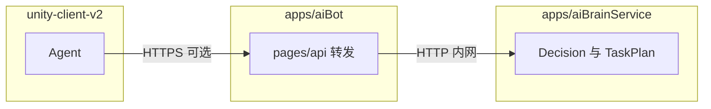
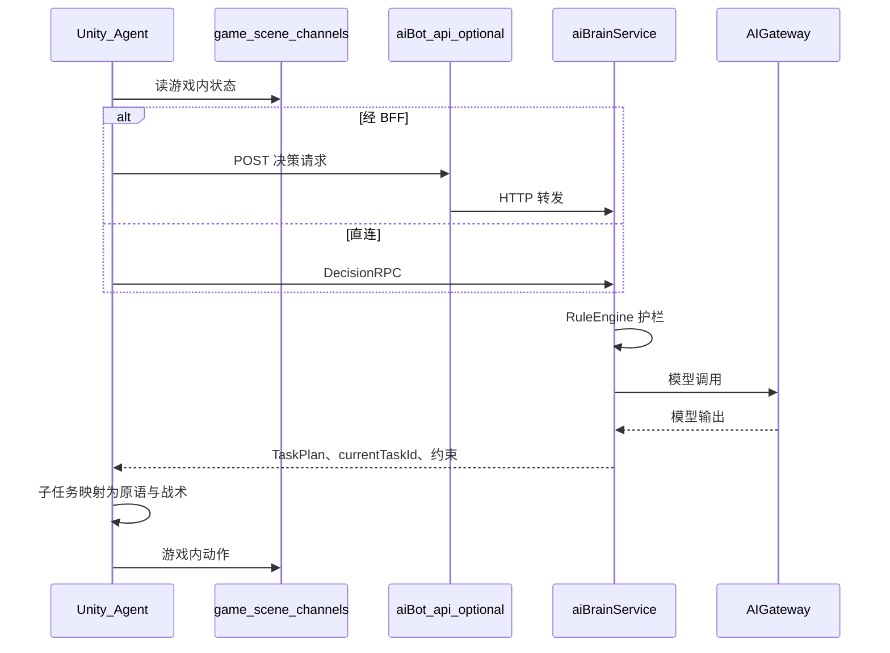
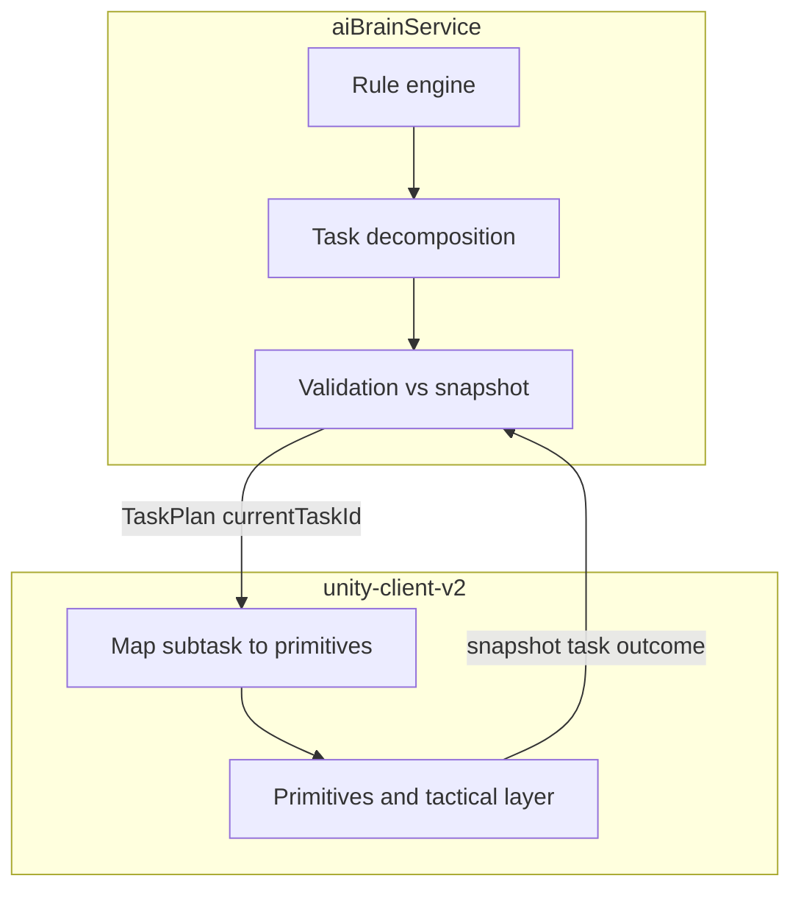

## 时间: 2026-03-23 CST（2026-03-23 修订：§4.2 决策流水写入主体、`AGENTS` 交叉引用）

## 任务: AI Brain Service（AI大脑）与决策分层落地

# 最终任务包

本文档将 `AI Brain Service`、`AI Gateway`、Unity 侧职责、**WorldSnapshot → Brain** 主路径、**长链任务由 Brain 分解**、执行原语与外部仓库依赖**整理为单一事实来源**，供实现与评审对齐。若与 [002](./002_架构选型与发布方案.md)、[003](./003_开发计划与任务拆解.md) 冲突，**先改本文档与 002/003，再改 [AGENTS.md](../AGENTS.md)**。

---

## 1. 目标

- 明确 **大脑代码落点**：`apps/aiBrainService`（独立应用），**不**放在 `apps/aiBot/src` 下（与 [AGENTS.md](../AGENTS.md) 一致）。
- 明确 **模型接入**：经 **AI Gateway** 统一 key、路由、限流、预算、计量、审计（见 [002](./002_架构选型与发布方案.md)）。
- 明确 **决策分层**：护栏规则、战略/分层任务规划在 Brain；**战术与最小颗粒执行**在 `unity-client-v2`；避免每帧调大模型。
- 明确 **游戏事实主路径**：Unity 聚合状态 → **结构化快照** → Brain；首版 Brain **不强制**直连 `game-services-v2`。
- 明确 **可选通信拓扑**：Unity 可先调 **`apps/aiBot`（pages/api）**，再由 **服务端 HTTP 转发** 至 `apps/aiBrainService`（§4.1）。
- 明确 **`aiBrainService` 内两大块**（§9.1）：**LLM / Gateway 推理接入** 与 **决策与任务类数据的持久化**（与 `apps/aiBot` 注册表边界分清）。
- 明确 **决策/任务流水写入主体**（§4.2，**已确认**）：**仅 `aiBrainService` 在决策路径上落库**；`apps/aiBot` **不**重复实现大脑侧业务库逻辑。
- 明确 **长链目标**（如合成装备链）：由 **Brain（LLM 与/或符号规划 + 校验）** 产出 **TaskPlan / 子任务**；Unity **只做行为原语映射与执行**（见 §7）。
- 明确 **Unity 行为原语**：当前枚举为**方向性**清单，**原子行为尚未完备，后续在客户端补齐**（见 §6）。

---

## 2. 范围内

- **决策流水写入主体**（§4.2）：与 `apps/aiBot` 的边界（**已确认**）。
- `apps/aiBrainService` 的目录职责、建议模块划分、Decision RPC 契约方向。
- Unity 侧 **Execution Primitives** 的定位、与 Brain 输出的映射关系；**不**在本文件规定具体 C# 类名与游戏内每一个 API 调用（由 `unity-client-v2` 迭代补齐）。
- 与 [001](./001_AI真实行为赚钱Bot全局总策略.md)、[002](./002_架构选型与发布方案.md) 中术语对齐：`AIBot(机器人)`、`AI Brain Service`、`AI Gateway`、`AIBotPolicyState` 等。

## 3. 范围外

- Unity Client、game-services、合约等**具体仓库内的实现**（本文件只列依赖与数据流）。
- 正式 **Agent Session Channel (WSS)** 的完整协议与字段级定义（可在后续 plan 或 OpenAPI 中展开）。
- 生产级钱包验签、`/api/auth/*`（当前 [005](./005_AIBot机器人创建与管理.md) 仍为信任 `walletAddress`）。

---

## 4. 仓库与组件边界（摘要）

| 组件 | 路径/位置 | 职责 |
|------|-----------|------|
| Web 管理 | `apps/aiBot` | `AIBot` 创建/管理、钱包连接；**不承担**游戏内实时主决策 |
| AI 大脑 + 网关（逻辑分层） | `apps/aiBrainService` | 策略护栏、分层任务规划、TaskPlan、经 Gateway 调模型 |
| 游戏执行与战术 | `unity-client-v2`（仓外） | 快照采集、原语执行、`node-tactical-policy`、`runtime-guard` |
| Unity 原子行为 | 同上 | **持续补齐**；本 plan 仅约定「最小颗粒 + 预条件/失败码」原则 |

### 4.1 Unity → `aiBot` → `aiBrainService`（可选 BFF）

**结论：可以，且是常见做法**：让 **Unity 只与 `apps/aiBot` 暴露的 HTTPS 端点**通信（与现有「Web 管理同一站点/域名」一致），由 **`pages/api` 中的路由**再 **HTTP 调用** `apps/aiBrainService` 的 Decision 接口，把 **TaskPlan** 等结果原样返回 Unity。

**适合的原因**：

- **统一入口**：钱包、`AIBot` 元数据与「决策请求」可走同一应用边界，便于日后加 **鉴权、限流、审计日志、请求 ID**。
- **隐藏内部地址**：`aiBrainService` 可不公网直连，仅内网/服务网格可达。
- **部署解耦**：Brain 进程独立扩缩容，`aiBot` 只做轻量转发时负载可控。

**需注意**：

- **多一跳延迟**：高频路径应对 **超时、连接池、失败重试** 有明确策略；决策 RPC 本身已是「非每帧」，一般可接受。
- **`aiBot` 不做业务重复**：转发层应 **薄**——不复制 `ruleEngine` / TaskPlan 逻辑；**护栏与规划**仍在 `aiBrainService`（或明确若将来在网关做「二次校验」需单独设计）。**决策流水写入** 见 **§4.2**，**不得**在 `aiBot` 再实现一套大脑侧库写入。
- **可用性**：若 Unity **仅**依赖 `aiBot` 转发，则 `aiBot` 与 `aiBrainService` 的 **健康检查与降级**（超时提示、重试）需纳入运维。

**与「直连」对比**：Unity **也可**在配置中写 `AI_BRAIN_BASE_URL` **直连** `aiBrainService`（少一跳）；二者选其一或分环境（开发直连、生产经 BFF）均可，**契约**（`DecisionRequest`/`Response`）应相同。

### 4.2 决策流水与 DB 写入主体（**已同意，正式条款**）

以下作为实现与 Code Review 的**硬约束**，避免 `aiBot` 与 `aiBrainService` 各写一套「大脑数据」。

1. **写入主体**  
   - **任务记录、决策记录、子任务执行结果、复盘所需的追加流水** 等，**必须在 `apps/aiBrainService` 内**、沿 **Decision RPC 处理链**（推理前/后、校验后等约定钩子）**写入**对应表。  
   - **数据归属**：与 [002](./002_架构选型与发布方案.md) 中的 `decision-journal`、策略演进数据一致，**逻辑上属于大脑数据域**。

2. **经 BFF（§4.1）转发时**  
   - `apps/aiBot` 的 `pages/api` **仅转发** 请求与响应，可携带 **请求 ID、网关日志、限流**；**不在此路径上实现第二套**「决策流水 / 任务流水」的 **业务写入**。  
   - 落库仍在 **`aiBrainService` 处理该次 Decision 时**完成（即：**转发后仍由 Brain 写**）。

3. **`apps/aiBot` 不承担**  
   - **不**维护与大脑侧重复的 **journal / 任务执行明细** 表写入逻辑（避免双写、不一致）。  
   - **不**把「大脑业务库」拆一半放在 Next API 里；`aiBot` 继续以 [005](./005_AIBot机器人创建与管理.md) 的 **`aibots` 注册 CRUD** 为主。

4. **Web 展示**  
   - 复盘页、列表 API 若放在 `aiBot`：**只读**查询——数据来源为 **Brain 写入的表**（同库可读副本或直接查库），或经 **`aiBrainService` 提供的只读查询 API**；**写入仍不经由 `aiBot` 业务层重复实现**。

5. **例外（需显式文档）**  
   - 若未来必须在边缘写审计副本，须在 plan 中单独立项，并保证 **单一事实来源** 与对账策略。

---

## 5. AI 如何决策：三层（避免每帧调模型）

与 [002](./002_架构选型与发布方案.md) 一致：**平台 Brain** 输出 **约束与任务计划**；**Unity** 负责 **高频战术与原子执行**。

| 层级 | 位置 | 做什么 | 典型触发 |
|------|------|--------|----------|
| **策略护栏（硬规则）** | `aiBrainService` | 调用 LLM **前**裁剪策略：如未达最低门槛则强制 `growth`、风控、审批状态 | 每次 Decision RPC 或状态显著变化 |
| **战略 / 分层任务规划** | `aiBrainService` | 选主目标，将长链目标 **分解为可校验子任务树**（§7）；LLM 与/或符号规划 + **校验** | 子任务完成、失败、快照显著变化 |
| **战术与原子执行** | `unity-client-v2` | 寻路、施法、风筝、脱战、NPC/合成交互等；**帧/tick 级** | 本地战术层，非每步 RPC |

**说明**：低血量风筝、走位等为**强实时**，放在 Unity；Brain 输出 **TaskPlan + currentTaskId**（或当前叶节点），Unity 映射为**短原语序列** + 本地战术。

**游戏事实主路径**：Unity 从现有通道聚合 → **WorldSnapshot** + **AIBot** 配置摘要 →（**可选经 `apps/aiBot` 转发**，见 §4.1）→ **Decision RPC (HTTPS)** → Brain。

---

## 6. Unity 行为原语（Execution Primitives）

**目的**：提供一组**稳定、可测试、与协议对齐**的最小执行能力；Brain **不**下发任意字符串「点哪里」，而是下发结构化子任务，由 Unity **映射到原语**。

**当前状态**：下列类别与示例为**规划用命名**；**实际原子行为集合尚未完备，后续在 `unity-client-v2` 逐项补齐**，并统一预条件与失败码。

| 类别 | 示例原语（示意） | 说明 |
|------|------------------|------|
| 移动 | `MoveToPosition`、`MoveToEntity`、`MoveToNavTarget`、`WanderInRegion` | 坐标/目标/区域随机 |
| 战斗 | `EngageTarget`、`CastSkill`、`KiteAndFight`、`Disengage`、`UsePotion` | 高频，不经 Brain |
| 交互 | `InteractNpc`、`AcceptQuest`、`TurnInQuest` | 与 game channel / UI 桥接 |
| 经济/生产 | `CraftRecipe`、`ListItem`（若链上） | 见 [002](./002_架构选型与发布方案.md) 适配层 |
| 资源 | `Gather`、`Farm`、`Breed`、`Harvest` | 与快照内活动类型对齐 |
| 成长 | `UnlockTalentNode` 等 | 与 §8.3 一致 |
| 控制 | `Idle`、`AbortCurrent`、`PauseBot` | 与人工接管、审批配合 |

**契约原则**：

- Unity **不负责**长链产业链的**主规划**（与 §7 一致）。
- 每个原语具备 **预条件 / 失败码**，供 Brain **重规划**。
- Brain 除 TaskPlan 外，可下发 **当前叶节点子任务**；Unity 将其落实为**短原语序列**（仍是原子组合，非业务级 Planner）。

---

## 7. 长链任务：由 Brain 分解，Unity 执行当前子任务

### 7.1 职责

| 层级 | 谁负责 | 做什么 |
|------|--------|--------|
| 主任务与多级子任务 | `aiBrainService` | 将例如「合成 2 级战斗武器」分解为 **可检验** 的子目标树或有序列表；随快照与结果 **重规划** |
| 校验 | Brain 内 `ruleEngine` +（可选）与配置对齐 | 分解与快照中 **天赋、配方、材料、经验** 等一致，否则拒绝或重试 |
| Unity | 行为原语 + 战术 | 消费 **当前子任务**，执行并上报 **WorldSnapshot** 与 **子任务结果** |

### 7.2 示例：合成 2 级战斗武器（逻辑说明）

**主任务**：合成 2 级战斗武器。

**可分解为（示意）**：

1. 战斗天赋达到 2 级  
2. 已解锁对应合成配方  
3. 已凑齐所需材料  

若 **战斗天赋 &lt; 2**：

- 子任务 A：战斗天赋升至 2 级。  
- 若 **经验不足**：子任务 A1：通过击杀怪物获得经验至阈值 **XXX**（或直至可升级）。

**材料不足** 时，Brain 继续分解为获取材料、中间合成等子任务；Unity 对叶节点执行 **单次** 采集/合成等**原子**原语。

整棵任务树由 **Brain 持有**；Unity 不维护「唯一真相」级的 DAG Planner（可选仅缓存展示，见 §9）。

### 7.3 Brain 内实现选项

- **A**：LLM 输出 **TaskTree**（JSON Schema），**校验器**对照快照。  
- **B**：符号规划器 + 游戏配置，**确定性展开**；LLM 仅做主目标抉择或解释。  
- **C**：**混合**（推荐长期演进）：主目标与措辞用 A，分解用 B。

### 7.4 Brain ↔ Unity 接口（方向）

- **Brain → Unity**：**TaskPlan**（整树或增量）+ **currentTaskId**；可选 **expectedPrimitiveHints**（如 `grind_exp_until: XXX`）。  
- **Unity → Brain**：**WorldSnapshot** + **上一子任务结果**（`success` / `failed` / `blocked` + 原因码）。

---

## 8. 典型场景与快照字段（与早期讨论对齐）

### 8.1 战斗：移动、施法、残血风筝/脱战

- **Unity**：HP%、距离、CD、选怪与施法、脱战。  
- **Brain（可选）**：交战风格、撤退阈值（与 `AIBotPolicyState`、Web 配置一致）。  
- **快照示例**：`combat.hpPct`、`combat.inCombat`、`nearbyTargets[]`、`skills.available[]`、`policy.retreatHpThreshold`。

### 8.2 任务：NPC → 区域 → 打怪/采集/种植

- **Brain**：在可接/进行中任务上排序，输出子任务节点。  
- **Unity**：寻路、对话、区域、game channel / GraphQL（[002](./002_架构选型与发布方案.md)）。

### 8.3 天赋：花钱 vs 经验

- **快照**：`costGold`、`costExp`、`canAfford`、`prerequisiteMet` 等。  
- **Brain**：结合权重与阶段，输出节点 id 或 defer。

### 8.4 强制成长模式（未达最低门槛）

- **位置**：`aiBrainService` 内 **LLM 前** 护栏。  
- **逻辑示例**：若 `character.meetsWealthOrProgressMinimum === false`（字段名实现时确定），则 `effectivePolicyMode = growth`，禁止或过滤赚钱类子任务。  
- 与 [001](./001_AI真实行为赚钱Bot全局总策略.md) 阶段性策略一致；此处为**运行时门禁**。

---

## 9. 本仓库 `apps/aiBrainService` 建议目录（实现时）

### 9.1 服务内两大职责（是否合理：**合理**）

在**同一进程 / 同一应用** `apps/aiBrainService` 内，按**模块**拆成两块，边界清晰、与 [002](./002_架构选型与发布方案.md) 中的 `decision-journal`、计量与复盘一致：

| 块 | 内容 | 说明 |
|----|------|------|
| **① 推理接入** | 接入 **LLM 相关 SDK**、经 **AI Gateway** 的统一调用（key、路由、限流、计量、审计） | 只做「调用模型 + 解析结构化输出」，**不**把业务流水混在 SDK 封装里 |
| **② 持久化与整合** | 与 **AIBot 维度** 关联的 **任务记录、决策流水、子任务结果、复盘摘要** 等 **DB 写入与查询** | 对应「收集和整合」运行期数据，供 Web 复盘、计费对账、策略演进；表结构可与 `aibots` **同库不同表**或独立 schema，**表职责与 `apps/aiBot` 的注册 CRUD 分开** |

**与 `apps/aiBot` 的分工**：

- **`apps/aiBot`**（[005](./005_AIBot机器人创建与管理.md)）：用户创建/编辑 **机器人注册信息**（`aibots` 一行、钱包维度），**不**承担高频决策流水写入。
- **`apps/aiBrainService`**：**每次/每阶段决策** 与 **任务执行记录** 的追加写入、按 `wallet`/`aibotId` 查询列表，属于 **Brain 侧数据面**。

**与 §4.2 一致**：流水 **只**在 Brain 决策路径落库；BFF 转发不改变写入主体（见上）。

若未来单库压力过大，可将 ② **读副本**或**分表**演进，但**逻辑上仍归属大脑数据域**。

**反模式**：在 `aiBot` 的 Next API 里写大量决策流水、或让 Brain 直接改 `aibots` 业务字段（除明确需要的同步字段外）——应避免，以免边界模糊。

### 9.2 建议目录（对应 9.1）

- `src/index.ts` / `server.ts`：HTTP 入口。  
- `src/routes/health.ts`：`GET /health`。  
- `src/routes/decision.ts`：`POST /v1/decision`（或 `rpc/decide`）。  
- `src/policy/ruleEngine.ts`：护栏（含 §8.4）。  
- `src/brain/llmClient.ts`：**①** 经 Gateway 调模型。  
- `src/gateway/`：**①** key、路由、限流占位。  
- `src/db/` 或 `src/persistence/`：**②** 连接与迁移/SQL 脚本（与 [005](./005_AIBot机器人创建与管理.md) 区分表）。  
- `src/journal/` 或 `src/records/`：**②** 决策记录、任务记录、子任务结果的写入与查询接口（命名实现时定）。  
- `src/types/decision.ts`：与 Unity 共用的请求/响应类型。

`apps/aiBot`：继续只做 Web CRUD（注册表）；共享 DTO 可放 `src/message` 或后续 `packages/aibot-contracts`（需 workspace 约定）。

**测试**：`ruleEngine`、decision 路由、**journal 持久化** 建议 Vitest（目录实现时定）。

---

## 10. 外部依赖仓库映射（路径为团队约定）

| 路径 | 与 Bot 的关系 | 首版 Brain |
|------|----------------|------------|
| `.../game-services-v2` | 任务、天赋、角色与场景等主数据语义 | 经快照消费，不强制直连 |
| `.../scene-server-v2` | 场景服务 | 不经 Brain 直连 |
| `.../unity-client-v2` | 快照、原语、RPC 客户端 | 决策闭环一端 |
| `.../theweb3-v2` | 链通讯中间层 | 执行在 Unity，Brain 一般不直连 |
| `.../contracts-monad-v2` | 合约规则 | 策略间接影响，执行在客户端/链适配 |
| `.../service-xlsx-tool-v2` | 配置导入 | Brain 通过快照见解析后结果 |
| `.../services` | 用户、GraphQL 等 | 首版不强制 Brain 直连 |
| `.../lumiterrator-v2` | 抽奖、商城 | 公共情报可后续接入；首版快照可简化 |

---

## 11. 可选演进

- **混合权威源**：Brain 异步拉取服务端数据与快照对账。  
- **WSS**：Agent Session Channel（[002](./002_架构选型与发布方案.md)）。  
- **Unity 只读缓存 TaskPlan**：仅展示或降延迟，**以 Brain 校验与版本为准**。

---

## 12. 验收口径（文档级）

- 读者能回答：**大脑代码放哪、网关管什么、Unity 管什么、长链谁拆、快照怎么走**、**推理与 DB 两块是否分模块（§9.1）**、**决策流水谁写（§4.2）**。  
- 与 [002](./002_架构选型与发布方案.md)、[003](./003_开发计划与任务拆解.md) 里程碑 2（`aiBrainService` 骨架）可对照执行。  
- Unity 原子行为：**允许不完整**，但须在客户端 issue/清单中持续关闭 gaps。

---

## 13. 实施检查清单（供跟踪，非代码）

- [ ] 确认 AI Gateway 与 Brain **同进程** vs **独立部署**（职责不变）。  
- [ ] 确认 Unity → Brain 路径：**经 `apps/aiBot` 转发** vs **直连**（§4.1；契约一致）。  
- [ ] `apps/aiBrainService`：健康检查 + 占位 Decision RPC（对齐 [003](./003_开发计划与任务拆解.md) 里程碑 2）。  
- [ ] 若走 BFF：`apps/aiBot` 增加薄转发 `pages/api`（超时、日志，**不**复制大脑业务逻辑）。  
- [ ] 遵守 §4.2：**journal/决策流水仅在 `aiBrainService` 写入**；`aiBot` 无第二套大脑库写入；复盘页只读或调 Brain 查询 API。  
- [ ] 定义 `DecisionRequest` / `DecisionResponse`、`WorldSnapshot`、`TaskPlan` 最小字段。  
- [ ] 按 §9.1 拆分模块：**① LLM/Gateway** 与 **② 决策/任务流水 DB**；表与 `aibots` 边界清晰、迁移脚本独立。  
- [ ] 实现护栏：`ruleEngine` 在 LLM 前（含 §8.4）。  
- [ ] 与 Unity 约定共享类型落点。  
- [ ] `unity-client-v2`：**补齐**行为原语枚举与执行器，与 Brain 子任务类型对齐。  
- [ ] Brain：`TaskPlan` 分解 + **校验层**（防幻觉分解）。  
- [ ] 若有模型白名单、新表结构，同步更新本目录与 [AGENTS.md](../AGENTS.md)。
